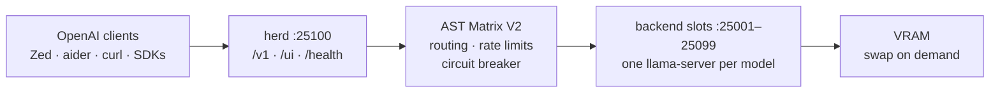

<div align="right">

[](https://github.com/toxicwind/herd)
[](https://github.com/mostlygeek/llama-swap)
[](https://github.com/toxicwind/herd/blob/main/go.mod)

</div>

# herd 🐂

> **Run a whole herd of LLM backends behind one OpenAI-compatible API.**  
> One port, one API, infinite models — herd swaps models in and out of VRAM on demand, routes requests with the AST Matrix V2 smart-routing layer, and serves everything over stable OpenAI-compatible endpoints. No containers required: the machine is the platform.

- 🦙 **Fork of [mostlygeek/llama-swap](https://github.com/mostlygeek/llama-swap)** — upstream's battle-tested swap engine, hardened for real deployments
- 🔀 **AST Matrix V2 routing** — token-bucket rate limiting, 5-strike circuit breaker, 8 routing strategies
- ⚡ **Zero-downtime model swapping** — models load/unload from VRAM on demand behind a single proxy
- 🔌 **OpenAI-compatible** — `/v1` endpoints plus `/ui`, `/health`, SSE streaming, and a synthesized `/models/sse` for Zed
- 🖥️ **Runs native** — `go build`, no container ceremony; Docker exists only as a fallback export format

**Security posture:** loopback-first by default (`127.0.0.1`), no external deps in the routing layer.  
**License:** ⚠️ the repo ships **no `LICENSE` file** — `package.json` declares `MIT`. See [License](#license--security).

## Why herd?

One GPU, dozens of models, zero orchestration ceremony. llama.cpp backends each want their own port and their own VRAM reservation; herd gives them one door and a smart bouncer:

- **Clients** see a single OpenAI-compatible API on `:25100` — Zed, aider, curl, any SDK.
- **herd** decides which backend serves each request, keeps hot models resident, evicts cold ones, retries and reroutes around failures.
- **Operators** get one config file, one health endpoint, and backends that restart cleanly even when a stale `llama-server` is squatting on a port.

**Who it's for:** anyone running local LLM inference on their own box who wants llama-swap's simplicity with sovereign-grade routing, hardening, and multi-provider smarts.

## Feature bullets

- 🧠 **AST Matrix V2** (`internal/astmatrix/`, stdlib-only, zero external deps) — token-bucket rate limiting, 5-strike/30s-cooldown circuit breaker, 8 strategies: `hybrid`, `ast_race`, `sticky_affinity`, `weighted_elo`, `least_latency`, `round_robin`, `free`, `circuit_chain`
- 🌐 **13 built-in providers** with base URLs (`internal/astmatrix/providers.go`) plus a built-in sovereign provider at `http://127.0.0.1:25100/v1`
- 📡 **SSE that behaves** — `normalize_sse` keeps streaming stable across heterogeneous backends; `GET /models/sse` synthesized for Zed (`internal/server/models_sse.go`)
- 🧹 **Self-healing process management** — pre-spawn `fuser -k` frees ports held by orphan `llama-server` processes (`internal/process/process_command.go`)
- 🌐 **IPv4 loopback default** — `127.0.0.1`, so dual-stack `localhost` never breaks dial (`internal/config/model_config.go`)
- 🔬 **Agentic lens suite** — stylometric authorship analysis, OSINT infra recon, crypto leak detection, tectonic drift lenses (`src/_11ty/lenses/*.js`, run by `.github/workflows/tectonic-drift.yml`)
- 📊 **Bench orchestrator** — benchmark backends and strategies head-to-head (`internal/bench/orchestrator.go`)
- 🗺️ **Mesh layout** — multi-node orchestration tooling under `mesh/` ([mesh README](mesh/README.md))

## Diagram



## Quick start

```bash
git clone https://github.com/toxicwind/herd.git && cd herd
make clean all          # or: go build -o herd .
./herd --config config.yaml --listen 127.0.0.1:8080
```

Health check: `curl -sS http://127.0.0.1:25100/health` → `OK`

## Ports

| Env | Port | Surface |
|---|---|---|
| `LLAMA_SWAP_PORT` | **25100** | Proxy + `/ui` + `/v1` |
| `LLAMA_START_PORT`–`LLAMA_END_PORT` | 25001–25099 | Backend slots owned by swap |

## Architecture

- **`llama-swap.go`** — entrypoint, upstream core (proxy + swap scheduler)
- **`internal/server/`** — HTTP surface: proxy, `/ui`, `/health`, `/models/sse`
- **`internal/astmatrix/`** — AST Matrix V2: `ratelimit.go`, `circuit.go`, strategy engine, `/astmatrix/status` + `/astmatrix/metrics` endpoints ([details](README_ASTMATRIX_V2.md))
- **`internal/config/`** — YAML config loading, validation, schema (`config-schema.json`)
- **`internal/process/`** — backend lifecycle: spawn, health, stale-port reclamation
- **`internal/bench/`** — benchmark orchestrator
- **`cmd/`** — helpers: `fake-model`, `simple-responder`, `vllm-wrapper`, `wol-proxy`, `monitor-test`, `test-concurrency`
- **`mesh/`** — multi-node orchestration ([mesh/README.md](mesh/README.md))
- **`ui-svelte/`** — web UI (bun + Svelte 5), `ui/` holds the upstream UI
- **`docs/`** — configuration guide, models doc, grafana dashboards, examples (`docs/examples/`)

Fork-specific work lives on `main` here; upstream is tracked as the `upstream` remote (`mostlygeek/llama-swap`):

```bash
git remote -v
# origin    https://github.com/toxicwind/herd.git (fetch)
# origin    https://github.com/toxicwind/herd.git (push)
# upstream  https://github.com/mostlygeek/llama-swap.git (fetch)
```

## Lineage

One coherent story, verified against git objects (2026-09-30):

1. **[mostlygeek/llama-swap](https://github.com/mostlygeek/llama-swap)** — upstream's
   battle-tested swap engine. Tracked as the `upstream` remote; upstream-sync
   commits merged through 2026-08-29.
2. **[toxicwind/sovereign-swap](https://github.com/toxicwind/sovereign-swap)** — the fork
   era (born 2026-08-17, same root commit `b63b81b1`). Upstream tracking plus
   estate hardening: toolchain-drift-guard CI, fork-aware GHCR tags, the
   estate-shaped FQN regression test.
3. **[toxicwind/herd](https://github.com/toxicwind/herd)** (this repo) — the canonical
   monorepo. Absorbed sovereign-swap 2026-09-14 (`9ff75904`, wrapped by true
   merge `18f8ac28`) and merged the ranch `stockyard/herd` lineage 2026-09-30
   (tailcat adapter, kubeswap operator, go 1.27.1, k8s.io v0.37.1).
   sovereign-swap remains untouched as a historical record.

**Why the Go module path is still `github.com/mostlygeek/llama-swap`:** renaming it
would break every import across the tree and every downstream consumer for zero
runtime benefit. The path is a fossil of the lineage above — deliberately kept,
documented here instead of "fixed".

## Config / optional services

herd config is YAML — see `config.yaml` (working example), `config.example.yaml`, and the full `config-schema.json`. Upstream docs cover the base schema; herd adds the `astMatrix` block:

```yaml
astMatrix:
  astStrategy: hybrid
  requestTimeout: 30s
  maxRetries: 3
  healthProbeInterval: 10s
  enableCoalescing: true
```

Optional services:

- **Agentic lenses** — configure via `.env.example` (keys for the lens suite), run through `.github/workflows/tectonic-drift.yml`
- **Grafana dashboards** — under `docs/grafana/`
- **🐳 Docker (fallback — not recommended)** — [](https://github.com/toxicwind/herd/actions/workflows/unified-docker.yml)

  > ⚠️ Docker works. It is also wrong for this stack: it fights your GPU (`--gpus`, `--runtime=nvidia` ceremony the native binary skips), turns 100GB of weights into a mount puzzle, inserts a shadow platform under your platform, and slows iteration (`go build` and run beats rebuild/push/pull/restart). It exists here as an **export format** for people who can't or won't run the native stack, and as CI's clean-room proof that herd assembles from nothing. If the machine is yours, go native.
  >
  > Images: `ghcr.io/toxicwind/herd:unified-<backend>` — built by `docker/unified/build-image.sh`, published by `.github/workflows/unified-docker.yml`.
  >
  > Rootless build note (2026-09-14): the rootless stage must use plain `docker build` (docker driver), **not** the buildx container driver — otherwise `FROM ghcr.io/toxicwind/herd:unified-<backend>` fails to resolve the local tag.

## Dev / contributing

```bash
make test          # go test ./...
make test-all      # full suite incl. UI
bun run build --root ui-svelte   # web UI
```

See [CONTRIBUTING.md](CONTRIBUTING.md) for the contribution rules. Maintainers squash-merge into `main`; PRs must reference an issue and stay small and focused.

## License + security

- **License:** this repo currently ships **no `LICENSE` file**. `package.json` declares `"license": "MIT"`, but without a license file that declaration is not a license grant. Until a `LICENSE` is added, treat the code as all-rights-reserved.
- **Security:** loopback-first defaults (`127.0.0.1`) — herd is built to serve the machine it's on, not the internet. The AST Matrix routing layer is stdlib-only Go (no external dependencies to audit). Backend slots are local processes; expose `:25100` beyond loopback only behind your own auth.
